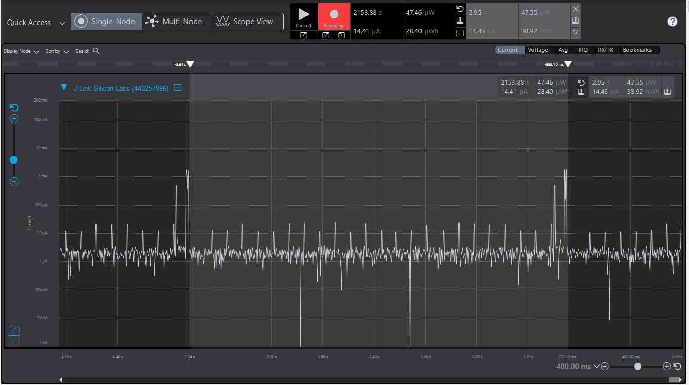
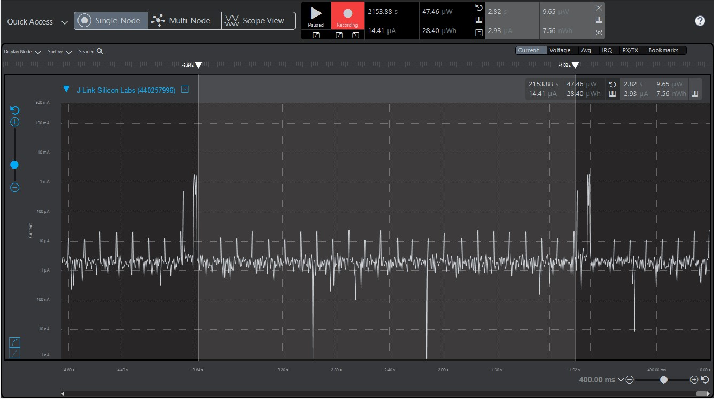
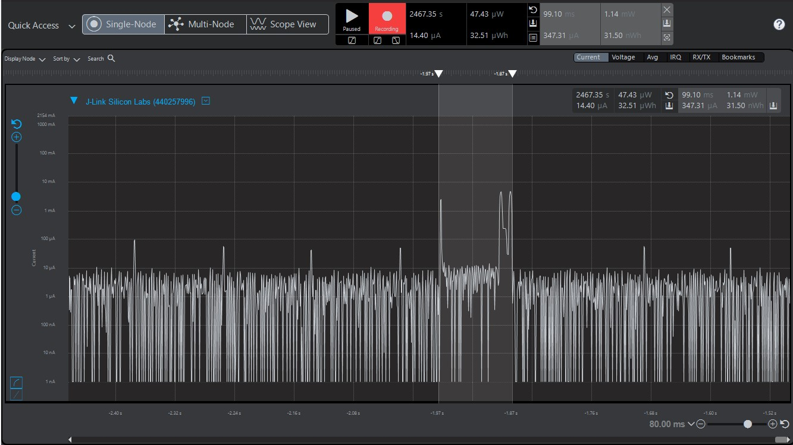

Please include your answers to the questions below with your submission, entering into the space below each question
See [Mastering Markdown](https://guides.github.com/features/mastering-markdown/) for github markdown formatting if desired.

*Be sure to take measurements with logging disabled to ensure your logging logic is not impacting current/time measurements.*

*Please include screenshots of the profiler window detailing each current measurement captured.  See the file Instructions to add screenshots in assignment.docx in the ECEN 5823 Student Public Folder.* 

1. What is the average current per period?
   Answer: 14.43uA
    Screenshot:  
     

2. What is the average current when the Si7021 is Powered Off?
   Answer: 2.93uA
    Screenshot:  
     

3. What is the average current when the Si7021 is Powered On?
   Answer: 347.31uA
    Screenshot:  
     

4. How long is the Si7021 Powered On for 1 temperature reading?
   Answer: 99.10ms
    Screenshot:  
     

5. Compute what the total operating time of your design for assignment 4 would be in hours, assuming a 1000mAh battery power supply?
   Answer (in hours): 1000mAH/14.43uA = 69300.06 hours
   
6. How has the power consumption performance of your design changed since the previous assignment?
   Answer: Tbe average current drawn per period has dropped from 148.98uA to 14.43uA, a reduction of close to 90% is seen as we take more control of the energy modes and make the processor sleep 
           when not required (timerwait delay period) through the state machine in Assignment 4, as compared to Assignment 3 where a busy wait implementation was used and the processor was turned 
           on even when its not required. This also improves the operating time by 10 times.