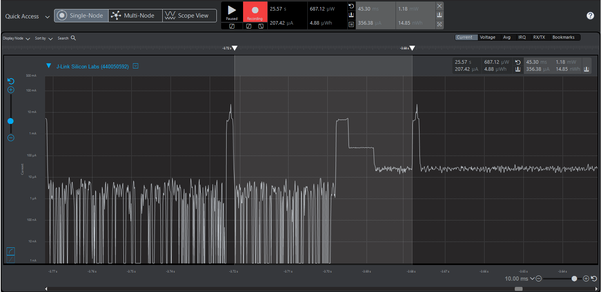

Please include your answers to the questions below with your submission, entering into the space below each question
See [Mastering Markdown](https://guides.github.com/features/mastering-markdown/) for github markdown formatting if desired.

*Be sure to take measurements with logging disabled to ensure your logging logic is not impacting current/time measurements.*

*Please include screenshots of the profiler window detailing each current measurement captured.  See the file Instructions to add screenshots in assignment.docx in the ECEN 5823 Student Public Folder.*

1. Provide screen shot verifying the Advertising period matches the values required for the assignment.
   Answer: Matches the value required for the assignment, 250ms
    Screenshot:  
     

2. What is the average current between advertisements (Don't measure an interval with a LETIMER UF event)?
   Answer: 1.20 uA (Between falling edge of first advertisement and rising edge of second advertisement)
    Screenshot:  
     

3. What is the peak current of an advertisement? 
   Answer: 27.63mA
    Screenshot:  
     

4. Provide screen shot showing the connection interval settings. Do they match the values you set in your slave(server) code or the master's(client) values?.
   Answer: 47ms. It matches with client (EFR connect app on phone)code and the value set for connection interval i.e 75ms in the server is not used.
    Screenshot: 
     

5. What is the average current between connection intervals (Don't measure an interval with a LETIMER UF event)?
   Answer: 356.38 uA (Between falling edge of first advertisement and rising edge of second advertisement)
    Screenshot:  
     

6. If possible, provide screen shot verifying the slave latency matches what was reported when you logged the values from event = gecko_evt_le_connection_parameters_id. 
   Answer: In the below screenshots, in the first one we can see that the peek current is 10.67 mA and in the second one it is 10.94 mA. This increase in current 
           corresponds to a successful indication being sent, and we can see that in the second image there is a small hump (referred by the circle) this is the part where the indication is packed. 
           Since all this happens between one connection interval, no connections intervals are skipped and therefore the slave latency is 0 as logged below. The client side slave latency is set to 0 and 
           server side slave latency is set to 4 in the code but that is not used.
            
           Credit: Arrived at the answer with the help of Aditi Vijay Nanaware
    Screenshot:  
     
    Screenshot:  
     
    Screenshot:  
     
